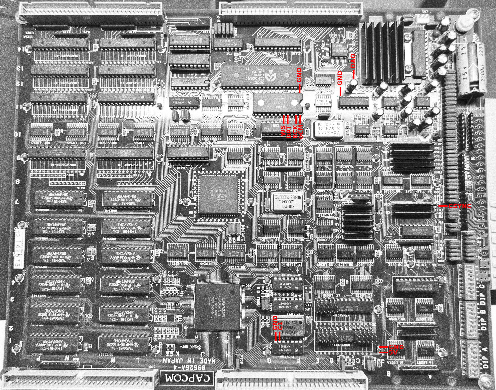
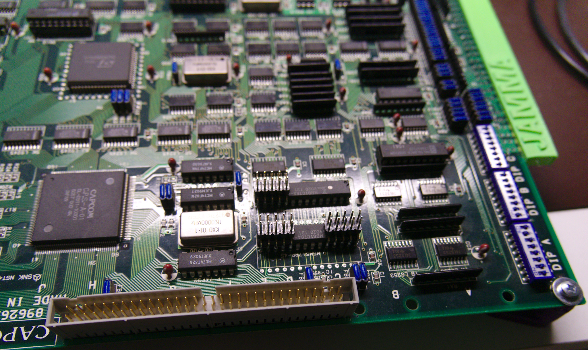
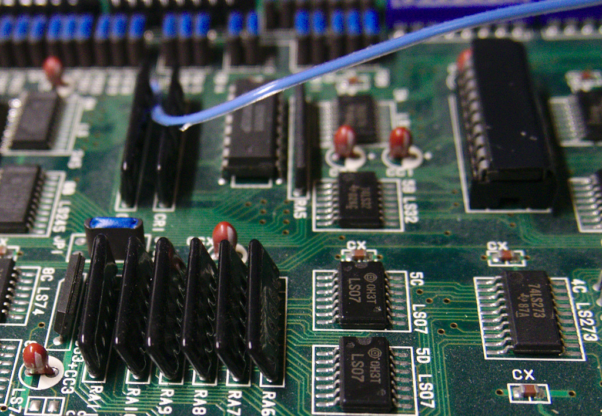

A-board (revision 89626A-4) signal reference
--------------------------
[List of hookup points](./cps1_hookup_points.txt)

Step 1: Preparation
--------------------------

Solder 3pcs U-shaped 2x5 headers M5M RAM chips as shown in the image below. Solder BCS-105-L-D-PE-BE sockets on cps1_adapter (J1-3) and trim down pin metals underside the PCB. Make sure the adapter PCB fits in place before going forward. Solder R7+R8 (2x10k 0603 SMD resistors) on bottom of cps2_digiav board. Install cps2_digiav on top of adapter board via 4pcs 5-pin headers without using spacers. It is recommened to cover cps2_digiav bottom side area touching PAL 10A1 IC with electrical tape as well as B-board bottom area above JTAG connector (full-length B-boards only).

Step 2: Clock and sync signals
--------------------------

Clock is available on 74F32. It's mandatory to use a coax cable to avoid stability issues caused by noise. Composite sync is extracted from R28 as shown in the signal reference image (connect to HS pin on cps2_digiav).

Step 3: Audio, power and button signals
--------------------------

Audio is extracted from YM2151 and R49. Use coax cable for oCM and DAO signals. 5V/GND can be extracted from certain CCX caps, e.g. the one shown in the signal reference image. Wire two external pushbuttons to the board: one terminal to GND and another to vol-/vol+.

Step 4: Signals between cps1_adapter and cps2_digiav
--------------------------

Bridge SMD jumpers J3, J5 and J6 on cps2_digiav board. Connect oC1, SH1, SO and 3v3 from cps1_adapter to cps2_digiav as defined in the hookup point list. Add a jumper wire between C1 and C2 pads.

