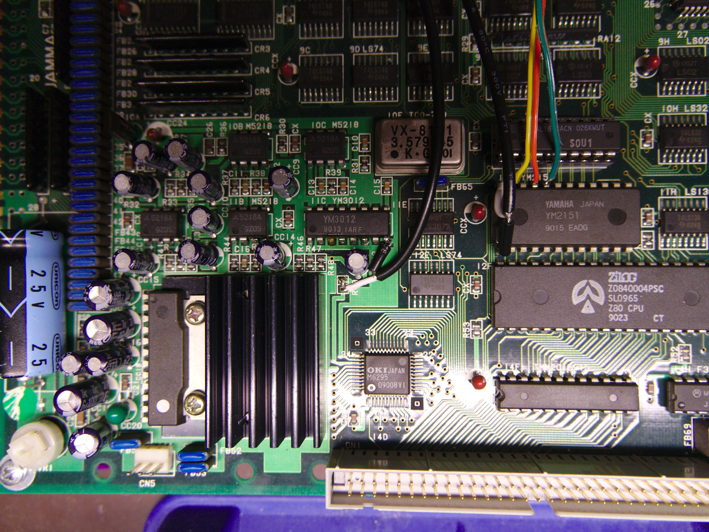
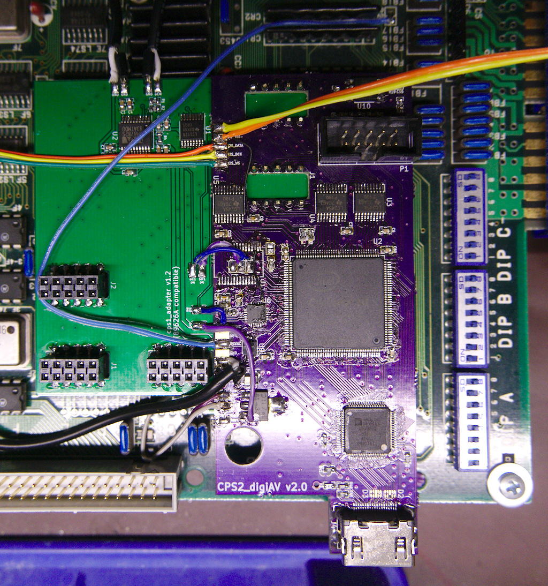
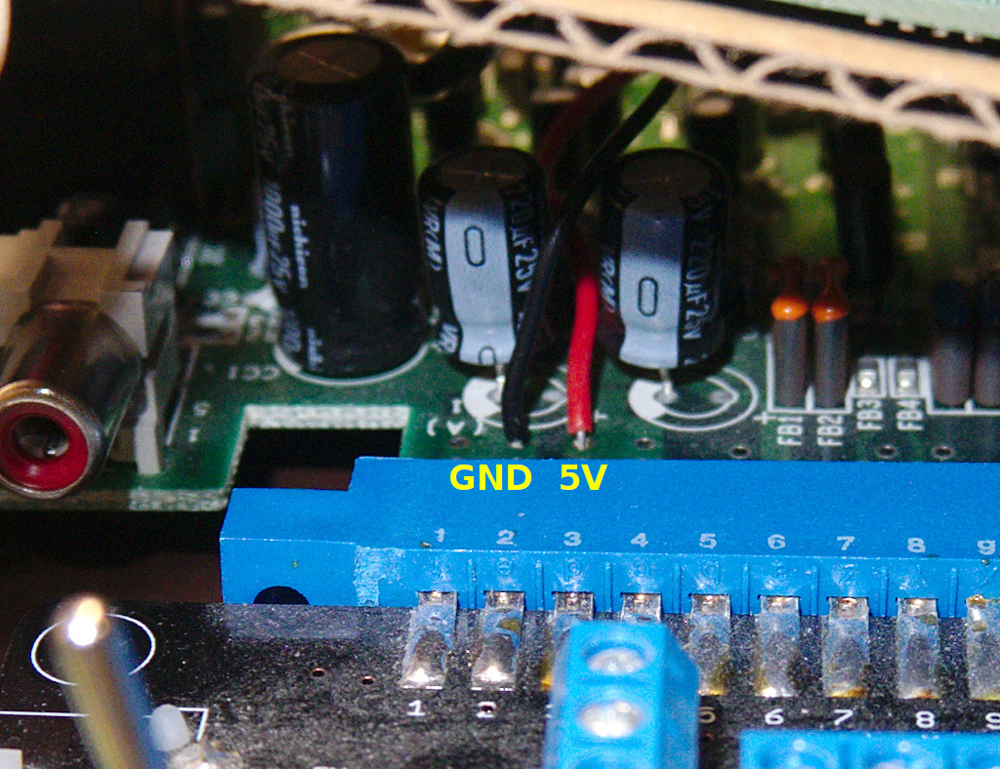
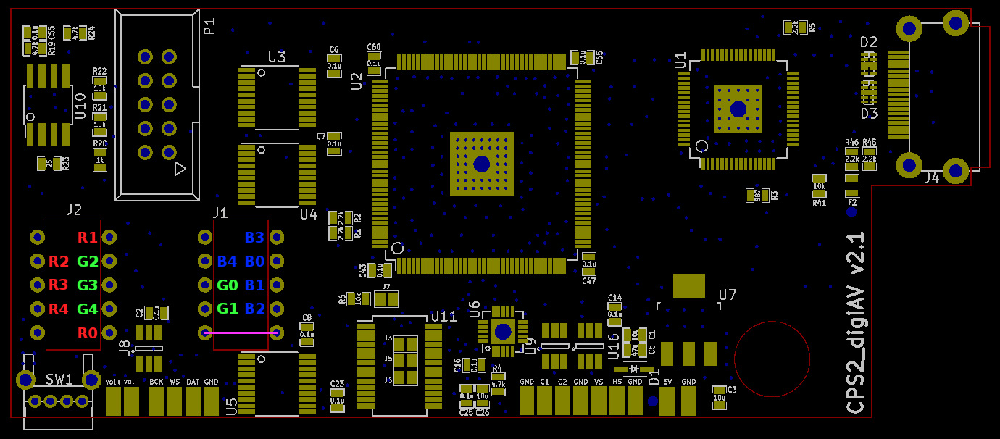
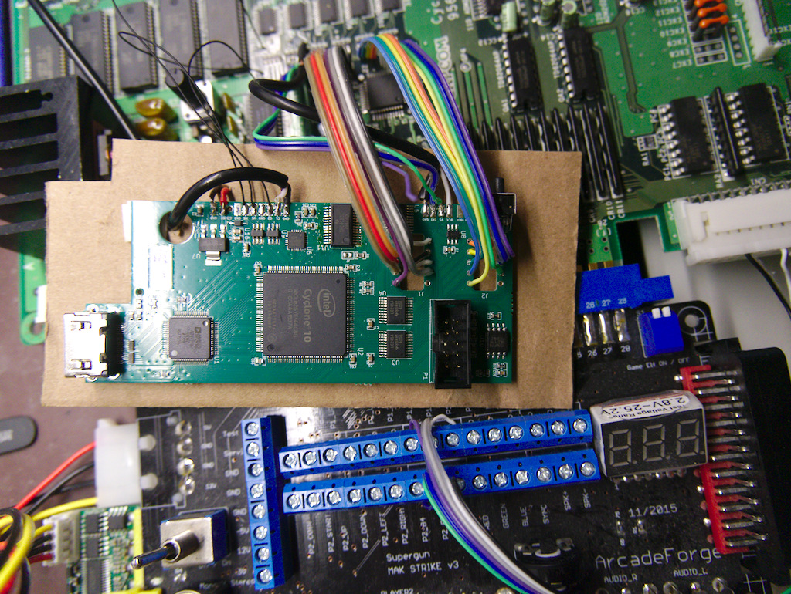

Step 1: clock and sync signals
--------------------------
Clocks and syncs are available on bottom side of CPS3 board. Extract 42.9545MHz clock (C1) from right side of R74 and video clock (C2) from left side of R36. For C1 it's mandatory to use a coax cable to avoid stability issues caused by noise. For C2 I was able to use a short kynar wire without issues, but depending on installation a coax might be needed as well. Horizontal and vertical sync are combined on factory-installed add-on board housing a LS08 chip. Extract HS from IN1 and VS from IN2. On later CPS3 revisions the LS08 may be integrated on the mainboard.

  

Step 2: RGB, audio and power signals
--------------------------

RGB, audio and power are easily available on top side of CPS3. Extract RGB and audio signals from RN7-RN3 resistor arrays as shown in the first image below. For BCK it's highly recommended to use a coax cable. 5V and GND can be extracted near JAMMA connector as shown in the second image.

 

Step 3: Preparation of cps2_digiav board
--------------------------

Solder U11 (SRC4190), SW1 (TL2243) and R7+R8 (2x10k 0603 SMD resistors) on cps2_digiav board.

Step 4: RGB hookup to cps2_digiav board
--------------------------

RGB signals are hooked to socket footprint holes on cps2_digiav board as illustrated below. Add a jumper wire between the holes connected by a magenta line in the image to avoid a floating extra input pin.

Step 5: Finalization
--------------------------

Hook the remaining signals to cps2_digiav board. Tape the board on top of a cardboard piece or find another way to prevent it touching CPS3 mainboard while in use.

After installation, FPGA firmware (output_files/cps2_digiav.jic) needs to be flashed (if board wasn't pre-flashed) via JTAG using Altera USB Blaster -compatible programmer while CPS3 is powered on.
